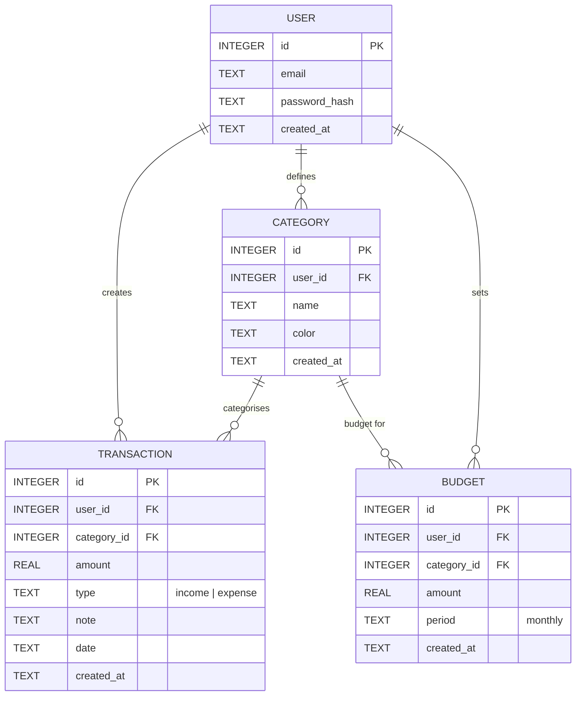

# DB_DESIGN – 個人記賬簿系統資料庫設計

## 1️⃣ ER 圖（Mermaid）

## 2️⃣ 資料表說明

### USER 表
- **id**: 主鍵，自動遞增。
- **email**: 使用者唯一的 Email，必填。
- **password_hash**: 使用 bcrypt 加密的密碼雜湊。
- **created_at**: 註冊時間，ISO 8601 字串。

### CATEGORY 表（自訂標籤）
- **id**: 主鍵。
- **user_id**: 外鍵，參考 USER.id，標示此標籤屬於哪位使用者。
- **name**: 標籤名稱，必填。
- **color**: 標籤顏色（十六進位或 CSS 顏色字串），可選，用於 UI 標示。
- **created_at**: 建立時間。

### TRANSACTION 表（收支紀錄）
- **id**: 主鍵。
- **user_id**: 外鍵，參考 USER.id。
- **category_id**: 外鍵，參考 CATEGORY.id（若使用者未指定，可為 `NULL` 且指向「未分類」），
- **amount**: 金額，正數，`REAL`。
- **type**: `income` 或 `expense`，文字型別。
- **note**: 可選的備註文字。
- **date**: 交易發生日期，ISO 日期字串（YYYY-MM-DD）。
- **created_at**: 紀錄建立時間。

### BUDGET 表（預算設定）
- **id**: 主鍵。
- **user_id**: 外鍵，參考 USER.id。
- **category_id**: 外鍵，參考 CATEGORY.id，允許 `NULL` 表示整體預算。
- **amount**: 預算金額，`REAL`。
- **period**: 預算周期，目前僅支援 `monthly`（未來可擴充為 `weekly`、`yearly`）。
- **created_at**: 設定時間。

## 3️⃣ 設計決策說明
- 使用 **SQLite**（單檔）降低部署門檻，適合個人或小型團隊使用。
- 所有表格均使用 **INTEGER PRIMARY KEY AUTOINCREMENT** 作為唯一識別。
- 時間欄位採用 ISO 8601 字串，避免 SQLite 原生 DATETIME 類型的兼容性問題。
- `type` 欄位以文字儲存，便於未來擴充（例如 `transfer`、`adjustment`）。
- 預算可以針對單一分類或整體，透過 `category_id` 為 `NULL` 表示全局預算。

---
*此文件根據 `docs/PRD.md` 與 `docs/FLOWCHART.md` 產出，由 Antigravity 於 2026‑04‑28 自動生成。*
