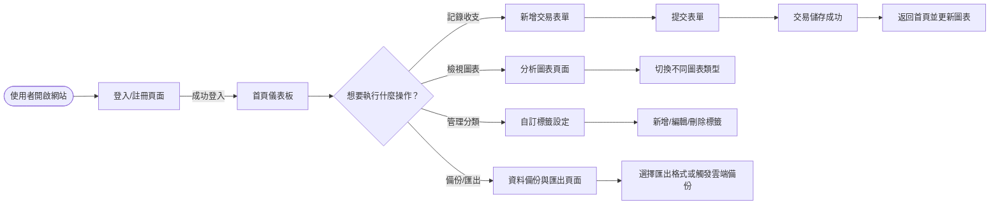
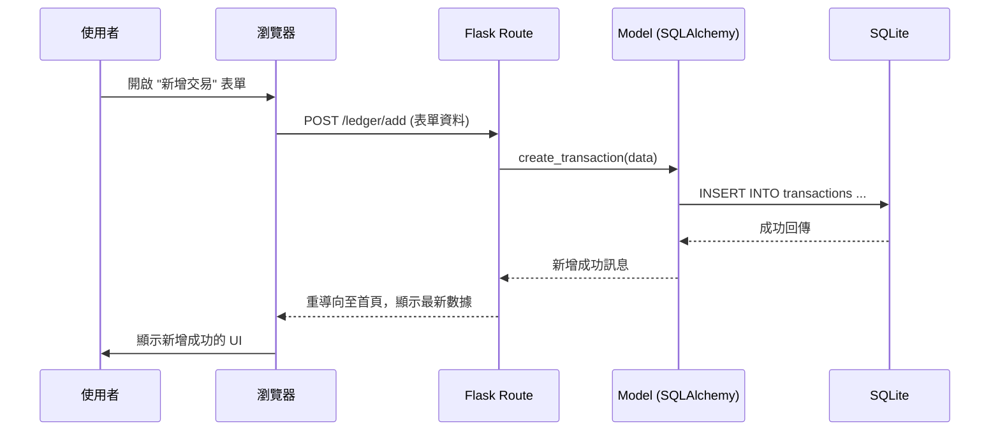

# 流程圖文件 – 個人記賬簿

## 1️⃣ 使用者流程圖（User Flow）



## 2️⃣ 系統序列圖（Sequence Diagram） – 新增交易流程



## 3️⃣ 功能清單對照表

| 功能 | URL 路徑 | HTTP 方法 | 說明 |
|------|----------|-----------|------|
| 收支快速紀錄 | /ledger/add | POST | 新增收入或支出交易
| 查看交易列表 | /ledger | GET | 顯示所有交易，支援分頁與過濾
| 編輯交易 | /ledger/edit/<id> | POST | 更新既有交易資料
| 刪除交易 | /ledger/delete/<id> | POST | 移除指定交易
| 預算提醒 | /budget | GET | 取得當前預算使用率與超支警示
| 圖表分析 | /dashboard | GET | 回傳圖表資料 JSON，供前端渲染
| 自定義分類 | /tags | GET/POST/PUT/DELETE | 管理使用者標籤
| 雲端備份 | /backup | POST | 手動觸發備份或匯出 CSV/Excel
```

---
*此文件根據 `docs/PRD.md` 與 `docs/ARCHITECTURE.md` 產出，由 Antigravity 於 2026‑04‑28 自動生成。*
